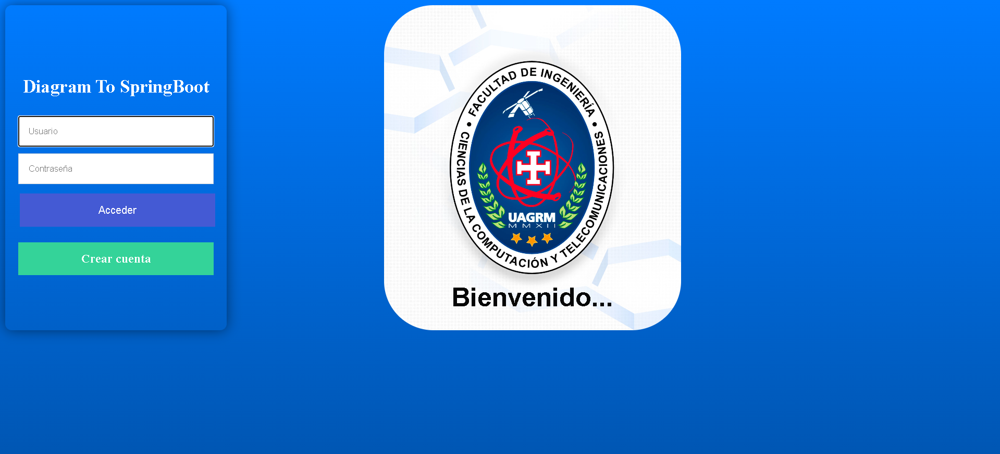
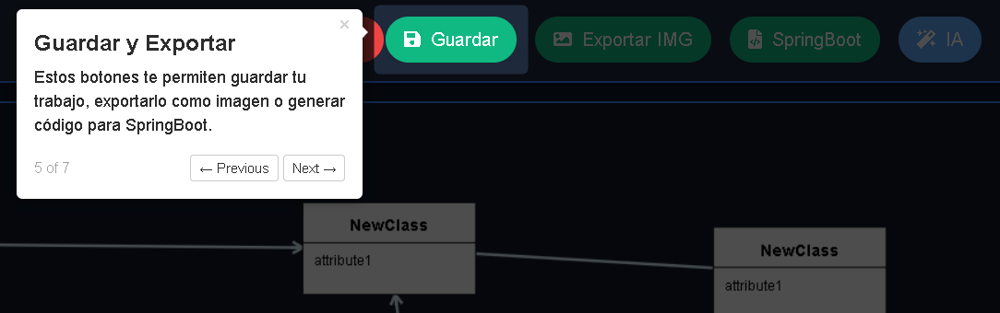

# Herramienta de Diagramado UML Web

Una aplicación web para crear, guardar y gestionar proyectos de diagramas UML. La aplicación permite a los usuarios registrarse, iniciar sesión y trabajar en un lienzo interactivo para diseñar sus diagramas.

## Características Principales

-   **Autenticación de Usuarios:** Sistema completo de registro e inicio de sesión.
-   **Gestión de Proyectos:** Crear, ver y administrar múltiples proyectos de diagramado.
-   **Lienzo Interactivo:** Una pizarra en tiempo real para dibujar diagramas UML (Clases y Relaciones).
-   **Persistencia de Datos:** Los proyectos y diagramas se guardan en una base de datos MySQL.
-   **Generación de Código:** Conversión de diagramas UML a código Spring Boot (Java).
-   **Colaboración en Tiempo Real:** Uso de Socket.IO para permitir la edición simultánea de diagramas.
-   **Integración con Gemini:** Generación de diagramas a partir de descripciones en lenguaje natural e imágenes.

## Tecnologías Utilizadas

-   **Backend:** Node.js, Express.js
-   **Frontend:** EJS (Embedded JavaScript templates)
-   **Base de Datos:** MySQL
-   **Autenticación:** bcryptjs, express-session
-   **Comunicación en Tiempo Real:** Socket.IO
-   **Desarrollo:** nodemon

## Esquema de la Base de Datos

Se utilizan dos tablas principales: `users` para la gestión de usuarios y `proyecto` para almacenar los diagramas.

```sql
-- Tabla de usuarios
CREATE TABLE `users` (
    `id` int NOT NULL AUTO_INCREMENT,
    `user` varchar(255) NOT NULL,
    `name` varchar(255) NOT NULL,
    `rol` varchar(20) CHARACTER SET utf8mb4 COLLATE utf8mb4_0900_ai_ci NOT NULL,
    `pass` varchar(255) NOT NULL,
    PRIMARY KEY (`id`)
);

-- Tabla de proyectos
CREATE TABLE `proyecto` (
    `id` int NOT NULL AUTO_INCREMENT,
    `name` varchar(50) NOT NULL,
    `link` varchar(255) CHARACTER SET utf8mb4 COLLATE utf8mb4_0900_ai_ci NOT NULL,
    `user_id` int NOT NULL,
    `objetos` json DEFAULT NULL,
    PRIMARY KEY (`id`),
    FOREIGN KEY (`user_id`) REFERENCES `users`(`id`)
);
```

## Instalación y Puesta en Marcha

1.  **Clonar el repositorio:**
    ```bash
    git clone https://github.com/JorgeLuisTorrezGarcia/Diagram-To-SpringBoot.git
    ```
2.  **Instalar dependencias:**
    ```bash
    npm install
    ```
3.  **Configurar variables de entorno:**
    Crear un archivo `.env` en la raíz del proyecto y añadir las credenciales de la base de datos:
    ```
    DB_HOST=localhost
    DB_USER=root
    DB_PASSWORD=tu_contraseña
    DB_DATABASE=nombre_de_la_bd
    ```
4.  **Ejecutar la aplicación:**
    ```bash
    npm run dev
    ```
    La aplicación estará disponible en `http://localhost:3000`.

## Manual de Usuario

A continuación se muestra el flujo de uso de la aplicación.

### 1. Inicio de Sesión
Página principal donde el usuario puede ingresar sus credenciales.



### 2. Vista de Proyectos
Una vez iniciada la sesión, el usuario ve la lista de sus proyectos existentes y puede crear uno nuevo.


### 3. Lienzo de Diagramado
Al crear o seleccionar un proyecto, se accede a la pizarra interactiva para dibujar.


### 4. MANUAL DE USUARIO
Nombre del proyecto





